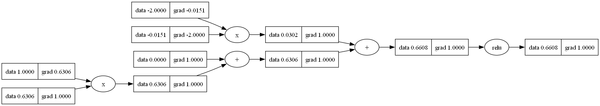

# micrograd


In this repository, you'll find a compact Autograd engine, spiced up with a touch of fun! It's designed for backpropagation (reverse-mode autodiff) across a dynamically constructed Directed Acyclic Graph (DAG). On top of this, there's a lightweight neural networks library, boasting a PyTorch-like API. Each component is remarkably small, with roughly 100 lines of code for the DAG and 50 for the neural networks library. The DAG handles scalar values exclusively, dissecting each neuron into its fundamental arithmetic operations. Yet, this simplicity doesn't hinder its capability to construct comprehensive deep neural networks for binary classification tasks, as demonstrated in the accompanying notebook. So, buckle up and get ready for a wild ride through the realm of tiny yet mighty neural networks!

## Example Usage
Here's a somewhat contrived example that illustrates several supported operations:

 ```python
 from micrograd.engine import Value
 a = Value(-6.0)
b = Value(5.0)
c = a + b
d = a * b + b**2
c += c + 1
c += 1 + c + (-a)
d += d * 2 + (b + a).relu()
d += 3 * d + (b - a).relu()
e = c - d
f = e**2
h = (b-a).relu()
g = f / 3.0
g += 10.0 / f
print(f'{g.data}') # prints 972.0034293552812, the outcome of this forward pass
g.backward()
print(f'{a.grad}') # prints -2016, i.e. the numerical value of dg/da
print(f'{b.grad}') # prints 1620, i.e. the numerical value of dg/db
```

## Training the Neural Network
The notebook ``demo.ipynb`` presents a comprehensive demonstration of training a binary classifier using a 2-layer neural network (MLP). This involves initializing the neural network from the ``micrograd.neural_network`` module, implementing a straightforward "max-margin" binary classification loss inspired by SVM, and employing Stocahstic Gradient Descent (SGD) for optimization. As illustrated in the notebook, utilizing a 2-layer neural network with two hidden layers, each containing 16 nodes, results in the depicted decision boundary on the moon dataset.


## Tracing / Visulisation

For enhanced ease of use, the notebook ``trace_graph.ipynb`` generates Graphviz visualizations. For instance, the one displayed below represents a basic 2D neuron, generated by invoking ``traceGraph.draw_dot(y)`` on the provided code. It illustrates both the data (left number in each node) and the gradient (right number in each node) and also represents the operation which was being performed to get that value.


<p align = "center">

</p>